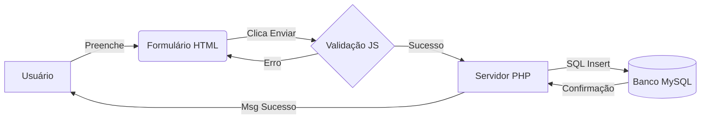

# Tema 8: Praticando (Estudos de Caso e Revisão)
**Data:** 26/12/2025 | **Status:** Concluído

## 1. O Projeto Fullstack
Neste módulo final, unimos todas as camadas estudadas para criar uma aplicação completa. O fluxo funciona assim:

1.  **Frontend (O que o usuário vê):**
    * **HTML:** Cria o formulário de cadastro.
    * **CSS:** Deixa o layout bonito e responsivo.
    * **JS:** Valida se os campos obrigatórios estão preenchidos antes de enviar.

2.  **Backend (O que o servidor processa):**
    * **PHP:** Recebe os dados do formulário, sanitiza (limpa) para segurança e monta a query SQL.

3.  **Persistência (Onde fica guardado):**
    * **MySQL:** Executa o `INSERT` e salva os dados permanentemente.

## 2. Fluxo de Dados na Prática



## 3. Exemplo de Integração (Código Conceitual)
Passo 1: HTML (index.html)

```HTML

<form action="salvar.php" method="POST">
    <input type="text" name="nome" placeholder="Seu Nome">
    <button type="submit">Enviar</button>
</form>
```

Passo 2: PHP (salvar.php)

```PHP

<?php
    $nome = $_POST['nome'];
    // Conecta e Salva no Banco...
    echo "Salvo com sucesso!";
?>
```

## 4. Conclusão da Disciplina
Dominamos a Arquitetura Cliente-Servidor.

Sabemos criar interfaces que funcionam no celular (Responsividade).

Sabemos dar vida à página com scripts (DOM).

Sabemos persistir informações para criar sistemas reais (PHP + SQL).
